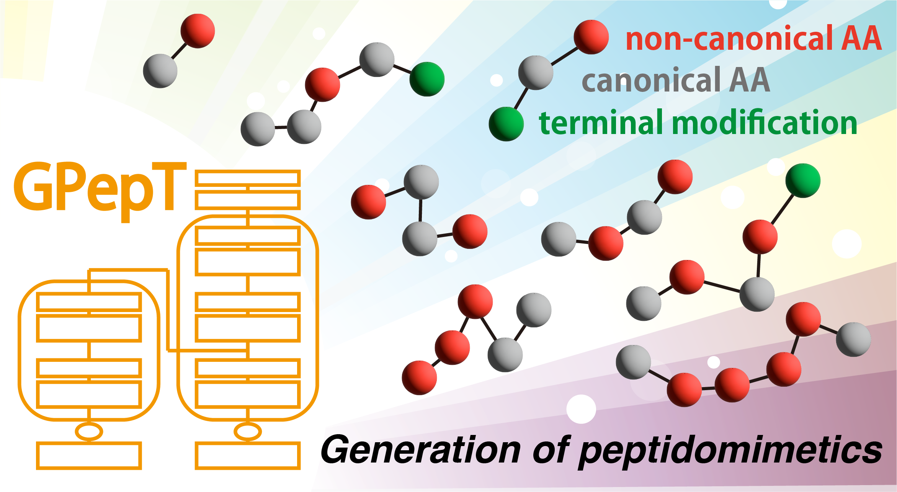
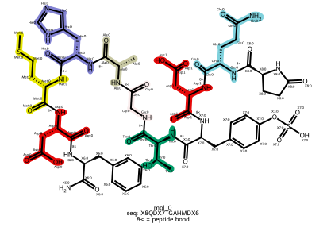

# Monomerizer

Monomerizer (or SMILES2Seq, #SMILES2FASTA) is a pipeline that converts peptides and peptidomimetics, represented as SMILES (chemical formulae), into sequences of amino acids and terminal modifications.

For more information, visit our [preprint](https://chemrxiv.org/engage/chemrxiv/article-details/67ecf39181d2151a02aad52a).



To use the output data to finetune our foundation language model for peptidomimetics, visit: [GPepT](https://huggingface.co/Playingyoyo/GPepT)

---

## Usage

To run a Monomerizer demo, use the following command:

```
python3 run_pipeline.py --input_file demo/example_smiles.txt
```

- By default, results will be saved to the `output/<datetime>` directory. The raw directory contains the raw result, and the standard directory contains the sequences after standardizing them to the standard dictionary accepted by GPepT.
- Replace `demo/example_smiles.txt` with the path to your input file containing SMILES strings.  (The input file must follow the format of the example files in the `demo` directory.)

---

### Optional arguments

- `--output_dir <path>`
- `--min_amino_acids <int>`: Minimum number of amino acids required for processing. Default is `3`.
- `--batch_size <int>`: Number of SMILES to process in each batch. Default is `100`.
- `--max_workers <int>`: Maximum number of parallel workers. Default is the number of available CPU cores.
- `-draw`: Draws output file like this.



---

## Generate Novel Peptidomimetics with GPepT

The GPepT model enables the generation of novel peptidomimetic sequences.  
For more details, please visit: [GPepT on Hugging Face](https://huggingface.co/Playingyoyo/GPepT)

---

## Analyse Your Molecules (Generated by GPepT)

To analyze molecules generated by GPepT:

1. Format the output sequences according to the required structure shown in the following [example file](https://github.com/tsudalab/Monomerizer/blob/main/demo/example_GPepT_generated_sequences.txt).

2. Run the analysis pipeline with the following command:

```
python3 GPepT_analysis_pipeline.py --sequence_file PATH_TO_INPUT_FILE
```

- By default, the demonomerized SMILES and the analysis report will be saved to the `output/<datetime>` directory.
- The analysis report includes molecular properties such as:
  - `MolWt`
  - `LogP`
  - `TPSA`
  - `FormalCharge`
  - `RotatableBonds`
  - `HydrogenDonors`
  - `HydrogenAcceptors`

To customize or extend the list of descriptors, feel free to edit [`src/analyse.py`](https://github.com/tsudalab/Monomerizer/blob/main/src/analyse.py).

---
